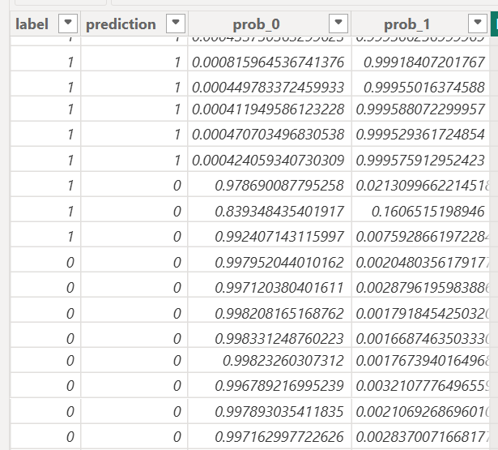

---
tags:
- Kedro
- Python
- Data Science
- Machine Learning
- TechNote
---

# Kedro

[[_TOC_]]

## Summary of Findings

Kedro is an open-source Python framework designed to add structure to data science projects. It's comparable to dbt, but
specialised for data science in Python (note: at Bluesmith, the current recommendation is for the default language for
data science to be Python anyway). This is worth considering for future work and is a prime candidate for a tech dojo,
since there are a number of areas of Kedro that weren't possible to investigate due to time constraints. From what was
investigated during this tech holiday, I think it would be a good choice for a data science project and has aims that
fit Bluesmith well:

- Reduce the time spent rewriting data science experiments so that they are fit for production.
- Encourage harmonious team collaboration and improve productivity.
- Upskill all collaborators on how to apply software engineering principles to data science code.

From experience, data science is an area where structure and good software practices are not as common and so Kedro can
be very useful. Kedro in many ways understands both the priorities of data science projects and the ways in which they
can be improved. The file structure is created out of the box, the [documentation is very good][kedro-docs] and
decisions are very sensible (e.g. having a `parameters.yaml` for defining parameters for machine learning experiments,
splitting the folder structure for settings that are shared with other users and settings that are user-specific - both
included in the `.gitignore` by default). Things just make sense.

There are 3 branches to Kedro which each have their own Python package:

- [Kedro][kedro-docs], which is the main package responsible for creating the pipelines, nodes, etc.
- [Kedro-Viz][kedro-viz-docs], which provides an interactive DAG for visualising Kedro pipelines (not unlike lineage
  visualisers in dbt).
- [Kedro-Datasets][kedro-datasets-docs], which provides ready-to-use dataset classes to simplify reading from/writing to
  various data sources.

During this investigation, I primarily investigated the first of these (Kedro). The conclusion of the tech holiday was a
small PoC I created for detecting fake news, both with dedicated fake/real news datasets and also detecting the
difference between headlines in the satirical news site The Onion and the r/not_the_onion subreddit (which posts
seemingly fake headlines from real news sites).

## Setting Up

Kedro has a detailed [tutorial][kedro-set-up] which walks you through the setting up stage. The only issue I encountered
was with PySpark, since this has a prerequisite that Java is installed. PySpark is one of the optional tools that the
CLI asks if you'd like to add to the setup:

```text
Tools
1) Lint: Basic linting with ruff
2) Test: Basic testing with pytest
3) Log: Additional, environment-specific logging options
4) Docs: A Sphinx documentation setup
5) Data Folder: A folder structure for data management
6) PySpark: Configuration for working with PySpark
7) Kedro-Viz: Kedro's native visualisation tool

Which tools would you like to include in your project? [1-7/1,3/all/none]:
 (none):
```

During my testing, the 7th option of Kedro-Viz wasn't listed (despite being in the tutorial example CLI output),
regardless of whether the `kedro-viz` Python package was installed or not. This wasn't an issue, but is worth noting as
a difference between the tutorial and my testing.

When you create a new Kedro project, the CLI offers the option of creating an example pipeline, which is very useful and
I'd recommend for learning how Kedro works. Kedro creates a `pyproject.toml` file by default and also uses ruff by
default (like the Python standards). This needs a couple of adjustments like the default line length and
`tool.ruff.lint` options, but it's good to see.

## Using Kedro

### Walkthrough of Key Terms and Files

As with most Python, Kedro projects should be created in a virtual environment. Each project is given its own folder
which has the following structure (where `kedro_project_name` and `pipeline_name` are instead the names of a Kedro
project and pipeline respectively):

```text
kedro_project_name/
├── .viz/
│   └── stats.json
├── conf/
│   ├── base/
│   │   ├── catalog.yml
│   │   ├── parameters.yml
│   │   ├── spark.yml
│   │   └── logging.yml
│   ├── local/
│   │   ├── .gitkeep
│   │   └── credentials.yml
│   ├── logging.yml
│   └── README.md
├── data/
│   ├── 01_raw/
│   ├── 02_intermediate/
│   ├── 03_primary/
│   ├── 04_feature/
│   ├── 05_model_input/
│   ├── 06_models/
│   ├── 07_model_output/
│   └── 08_reporting/
├── docs/
│   └── source/
│       ├── conf.py
│       └── index.rst
├── notebooks/
│   └── .gitkeep
├── src/
│   └── kedro_project_name/
│       ├── __pycache__/
│       ├── pipelines/
│       │   ├── __pycache__/
│       │   └── pipeline_name/
│       │       ├── __pycache__/
│       │       ├── __init__.py
│       │       ├── nodes.py
│       │       └── pipeline.py
│       ├── __init__.py
│       ├── __main__.py
│       ├── hooks.py
│       ├── pipeline_registry.py
│       └── settings.py
├── tests
│   ├── pipelines/
│   │   └── __init__.py
│   ├── __init__.py
│   └── test_run.py
├── .gitignore
├── info.log
├── pyproject.toml
├── README.md
└── requirements.txt
```

The key parts of this folder structure require a bit of explaining:

- `conf` is the folder for all config, split into `base` (for shared config) and `local` (for user specific config). The
  `local` config should never be added to source control, whereas `base` config is important to record for traceability,
  and consistency.
  - Usernames and passwords needed for specific data sources used by the project belong in `conf/local/credentials.yml`.
  - One of the most important files in the project is `conf/base/catalog.yaml`, which contains details of the class type
    and file location of each node in the project. One frustrating issue I found was sometimes it will just not run
    parts of the code if it can't find a node in the catalog, which is essentially a silent failure.
  - As mentioned earlier, `conf/base/parameters.yaml` is for defining parameters for machine learning experiments. For
    example, it can be used for specifying the train-test split. It's good practice to specify parameters in config so
    that the inputs for a run are easy to trace and tweak.
- `data` is the folder for all data, which is recommended to follow a very granular 8-part folder structure, which I
  found to be best explained in [this Towards Data Science article][towards-data-science-article].
- `notebooks` is for Jupyter notebooks. Data science often includes an element of trying different things out with the
  data and a popular choice for this in the sector is Jupyter notebooks, since it's easy to get instant feedback in the
  cells rather than having to rerun entire scripts.
- `src` is for scripts. The main two types of files are pipelines and nodes.
  - A node is just a Python function which is an atomic part of the analysis/data processing/etc. These are comparable
    to the views/tables in dbt.
  - A pipeline is a collection of nodes run in a particular order.
  - Therefore, the `nodes.py` file(s) contains the functions, whereas the `pipeline.py` file imports these functions and
    details the inputs and outputs of each node. The nodes of the pipelines don't need to be specified in any particular
    order, since the inputs and outputs determine the DAG of the pipeline.
  - When you run a pipeline, it's looking for the functions imported in the `__init__.py`  file in the same folder, so
    if the pipeline refuses to run, it's worth checking the import(s) isn't missing.

### Miscellaneous Notes

The following are a list of some notes that I made during this investigation:

- Kedro decouples the data from the code since it's best practice not to push data to version control to avoid leaking
  data.
- There is an official Kedro VS Code extension that I used and seemed to work fine.
- Kedro (the Python package) sends anonymous telemetry data, but can be turned off easily.
- You can specify how the nodes are run - in parallel, sequentially (default), or even using your own custom runner.
- Nodes don't have to be files; they can be totally in-memory. In this case, Kedro uses a MemoryDataset class instance
  (which is removed when all nodes that depend on that node are executed).
- I tried getting other datatypes like pickle and text to work in the `catalog.yaml` but Kedro wouldn't like it despite
  following the docs. This caused issues as not all Python data types can be cast to parquet files, so some nodes had to
  be changed to be MemoryDataset class objects, which meant that the analysis couldn't be resumed from those points.
- Like in dbt, you can resume a pipeline run from the nearest nodes with persisted inputs by using the `--from-nodes`
  parameter, e.g. `--from-nodes "renamed_onion_node,staging_true_node"`.
- You can do kedro run for specific pipelines e.g. `kedro run --pipeline=data_science` for the data science section of
  the analysis. This is similar to dbt.
- The pipelines are determined by the `pipeline.py` files in each folder. This modular pipeline structure of separating
  out the areas into different folders (e.g. `data_processing` and `data_science`) and is recommended by Kedro so that
  it's easier to dev, test and maintain the code.
- Namespaces can be used for separating out different areas of the pipeline. The parameters/inputs/outputs/variables/etc
  all get prefixes of the namespace. Namespaces can allow you to effectively duplicate nodes/pipeline sections without
  having to duplicate the code itself.
- You can add pipeline instances together like this code from
  `fake-news-detection\src\fake_news_detection\pipelines\data_processing\pipeline.py`, which uses namespaces for
  different data source pipelines and then combines the datasets:

```py
# Namespaced Pipeline
def acreate_pipeline(**kwargs) -> Pipeline:
    base_processing = pipeline(
        [
            node(
                func=load_and_preprocess_data,
                inputs=["raw_true", "params:flag_true"],
                outputs="staging_true",
                name="staging_true_node",
            ),
            node(
                func=load_and_preprocess_data,
                inputs=["raw_fake", "params:flag_fake"],
                outputs="staging_fake",
                name="staging_fake_node",
            ),
            node(
                func=join_fake_and_true_data,
                inputs=["staging_fake", "staging_true"],
                outputs="news_data",
                name="news_data_node",
            ),
        ]
    )

    ali_raza_pipeline = pipeline(
        pipe=base_processing,
        inputs={"raw_true": "ali_raza_true", "raw_fake": "ali_raza_fake"},
        parameters={
            "flag_true": "flag_true",
            "flag_fake": "flag_fake",
        },
        namespace="ali_raza"
    )

    bhavik_jikadara_pipeline = pipeline(
        pipe=base_processing,
        inputs={"raw_true": "bhavik_jikadara_true", "raw_fake": "bhavik_jikadara_fake"},
        parameters={
            "flag_true": "flag_true",
            "flag_fake": "flag_fake",
        },
        namespace="bhavik_jikadara"
    )


    return ali_raza_pipeline + bhavik_jikadara_pipeline
```

### Summary of PoC

The PoC Kedro project I developed during the tech holiday is available to view in the `kedro-2025-05` folder of the
[`tech-holidays` repo][tech-holidays-repo]. The aim of this code is to create a machine learning pipeline which
trains and tests a model to detect whether a news headline is fake news or real.

This is made up of 2 areas: `data_processing` (which loads the CSV data and reshapes it) and `data_science` (which
trains and tests a BERT model to predict whether news is fake or real). The Kaggle data sources used are linked in the
`catalog.yaml` file. The model took a while to run the whole pipeline (over 9 hours overnight), though the results were
very strong:

|               | Real (Predicted) | Fake (Predicted) |
|---------------|------------------|------------------|
| Real (Actual) | 470              | 0                |
| Fake (Actual) | 3                | 2071             |



As impressive as that seems, this is likely because the data wasn't cleaned properly, so there were markers which gave
away which dataset it came from. For example, the body of the text was included despite later realising the column in
the `r/not_the_onion` dataset shouldn't be used (it's the Reddit commentary, rather than the article text and is blank
for a lot of the data). Also, The Onion dataset has body of text that consistently starts with a place name in capitals.
If I were to do this again, I would only use the title as the feature, remove any columns that are unusable (e.g. a
title of just "Comment") and add the `val_text` further down the data science pipeline so that you can see which
specific headlines the model got wrong. The main part of Kedro functionality that I'd want to change would be retrying
the different datatypes because that would enable testing from midway through the pipeline more easily. At the moment,
several steps are MemoryDataset class objects, so they don't persist as files after the run is complete.

This data science code was never meant to be perfect since the tech holiday was to investigate Kedro, so time spent
investigating the functionality was prioritised over improving the analysis.

### Suggested Areas to Investigate in Tech Dojo

As mentioned in the [summary](#summary-of-findings), Kedro is an excellent choice for a tech dojo. There was one planned
for summer of 2025, but due to a number of new projects being signed in short period of time, this was abandoned. There
are a number of areas of Kedro that weren't possible to investigate during this tech holiday due to time constraints. A
short list is provided below:

- Proposed tech dojo outcome: Understanding of more of the features and maybe have a more comprehensive project example,
  such as a starter project or recommendation of project layout.
- [Connect up to different data sources][connect-data-sources], such as SQL databases.
- What would be a good way of structuring the config/pipelines?
- Produce an example which has more complex usage of [Kedro-Viz][kedro-viz-docs]. I managed to get a simple DAG running,
  but it looks like Kedro-Viz can support more advanced usage, such as adding charts.
- Investigate use cases for [namespaces vs tags vs pipelines][namespace-tag-pipeline]
- Data versioning, e.g. by [connecting with Apache Iceberg][data-versioning-iceberg].
- Investigate [Kedro-Datasets][kedro-datasets-docs].
- Investigate deployment. Try running in a container or on a cluster or elsewhere on a cloud service provider. [Does
  Kedro work well with Databricks?][databricks-deployment]
- Investigate [logging in Kedro][logging].
- Investigate [testing in Kedro][testing].
- Investigate [debugging in Kedro][debugging].
- Investigate [formatting/linting in Kedro][formatting-linting].
- Investigate [machine learning integrations][mlflow].
- Are there any hidden costs for a full-on project?
- Investigate [Kedro's API][api].
- Investigate [Kedro in notebooks][notebooks], rather than scripts/pipelines/nodes.
- Investigate the [anonymous telemetry][telemetry]. It looks pretty easy to turn off and doesn't seem to be particularly
  problematic. Is there anything we should be aware about?

Some of these items likely won't take too much time/effort, though together, there's definitely more than enough for a
tech dojo. Please reach out to Joseph McLeish if you have any questions about this tech note, the PoC, or the tech
holiday.

<!-- Reference Links -->

[kedro-docs]: https://docs.kedro.org/en/stable/
[kedro-viz-docs]: https://docs.kedro.org/projects/kedro-viz/en/stable/
[kedro-datasets-docs]: https://docs.kedro.org/projects/kedro-datasets/en/kedro-datasets-7.0.0/
[kedro-set-up]: https://docs.kedro.org/en/stable/get_started/index.html
[towards-data-science-article]: https://towardsdatascience.com/the-importance-of-layered-thinking-in-data-engineering-a09f685edc71/
[tech-holidays-repo]: https://dev.azure.com/bluesmith-is-tech/R%20and%20D/_git/tech-holidays
[connect-data-sources]: https://docs.kedro.org/en/0.19.14/data/data_catalog_yaml_examples.html
[namespace-tag-pipeline]: https://docs.kedro.org/en/stable/deployment/nodes_grouping.html
[data-versioning-iceberg]: https://docs.kedro.org/en/0.19.14/integrations/iceberg_versioning.html
[databricks-deployment]: https://docs.kedro.org/en/0.19.14/deployment/databricks/databricks_notebooks_development_workflow.html
[logging]: https://docs.kedro.org/en/0.19.14/logging/index.html
[testing]: https://docs.kedro.org/en/0.19.14/development/automated_testing.html
[debugging]: https://docs.kedro.org/en/0.19.14/development/debugging.html
[formatting-linting]: https://docs.kedro.org/en/0.19.14/development/linting.html
[mlflow]: https://docs.kedro.org/en/0.19.14/integrations/mlflow.html
[api]: https://docs.kedro.org/en/0.19.14/api/kedro.html
[notebooks]: https://docs.kedro.org/en/0.19.14/notebooks_and_ipython/index.html
[telemetry]: https://docs.kedro.org/en/0.19.14/configuration/telemetry.html
