---
tags:
- CodeRabbit
- GPT
- LLM
- AI
- Machine Learning
- TechNote
---

# CodeRabbit

[[_TOC_]]

## Summary of Findings

CodeRabbit is an incredibly useful AI review tool that almost all projects should seriously consider using in some form.
It integrates with a variety of Git clients (as well as local IDEs like VS Code) to provide a first review pass and
improve PR descriptions. This should not be used as a sole reviewer on any PR and instead should augment existing
reviews, meaning:

- Fewer issues are missed in review.
- Changes are better documented with added explanations, breaking down the PR file-by-file and adding diagrams when
  necessary.
- The first chunk of review comments are already spotted in minutes by CodeRabbit, saving review time and making PRs
  both better quality by the time they reach peer review and easier to review because of the added explanations.

The AI bot is configurable, can save learnings to apply to future reviews and can participate in back-and-forth
discussions with users. The company takes data security seriously:

- [All queries to LLMs existing in-memory only and zero retention after each query][data-privacy-and-security]
- [No code used for training unless the repository is public][data-security]
- [All data collection and storage practices comply with both SOC 2 and GDPR][trust-coderabbit-ai]

There are a [few different pricing options available][pricing], though it's worth noting that reviews in IDEs don't seem
to be quite as detailed as those in PRs (at least from my limited testing).

## Setting Up

During this investigation, I tested CodeRabbit in GitHub, Azure DevOps and VS Code. GitHub was chosen as it is widely
regarded as the easiest client for Git integrations so it would potentially indicate the ceiling of CodeRabbit, Azure
DevOps was chosen because it's widely used on projects due to the integration with Azure, and VS Code was chosen because
it's the IDE of choice for the vast majority of Bluesmith (CodeRabbit is also compatible with Cursor and Windsurf).

### GitHub

This was the easiest to set up of all the platforms where I tested CodeRabbit. It's [only 2 clicks][github-setup], with
the first being to authorise CodeRabbit to have read access and the second to select the organisation(s) to connect to.

CodeRabbit automatically creates a user for reviews, so it's completely ready to go.

### Azure DevOps

[Azure DevOps required more steps to set up][azure-devops-setup] than GitHub, starting with the 2 different requests
which require approval from the DevOps Admin. During my testing, despite having a DevOps organisation which was created
by me, this still required the subscription-wide Azure DevOps Administrator to approve (which for Bluesmith is currently
only Stu Edmondson). For projects where this role is unknown, it can be found in Azure Portal in Microsoft Entra ID >
Manage (drop-down menu) > Roles and administrators > Azure DevOps Administrator.

The 2 links to the permissions that the admin is required to approve can be copied easily:

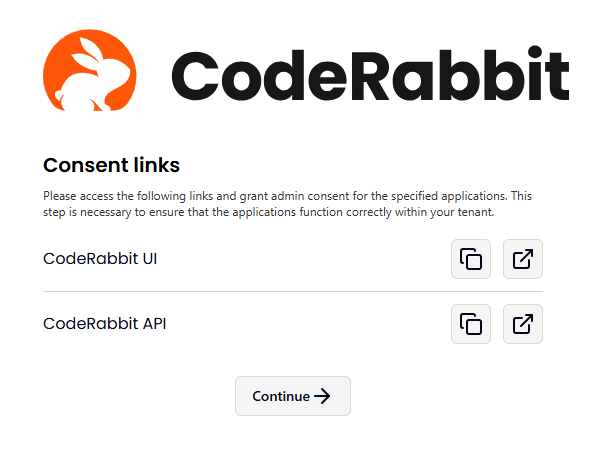

And the permissions required look like the following:

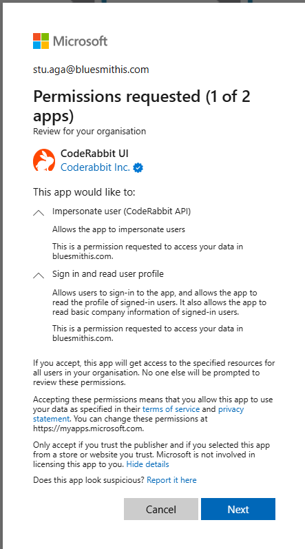 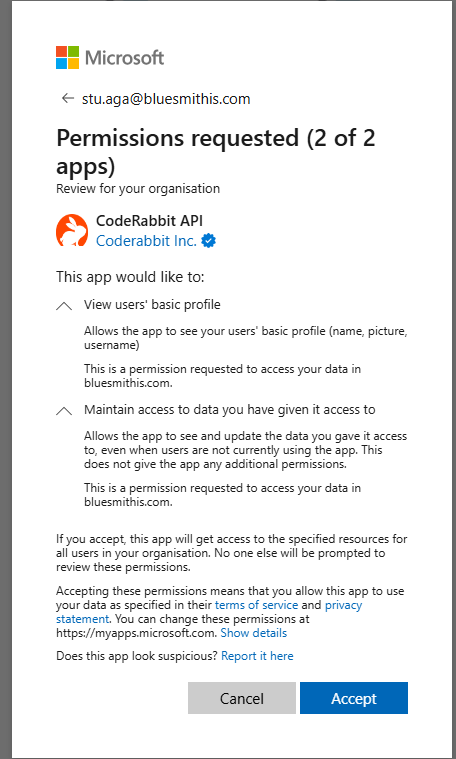 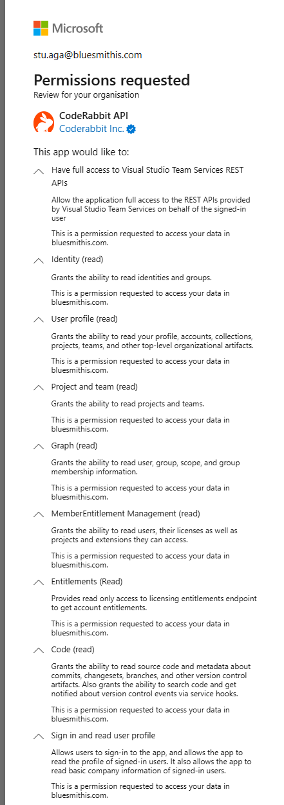

Once these have been approved, the DevOps organisation(s) can be selected and then the specific repositories can be
selected. After this, a Personal Access Token is needed, though it should be from a new DevOps account dedicated to
hosting CodeRabbit because this is the account that CodeRabbit will use. For the purposes of testing, I used my own
account, though this meant I encountered issues later because CodeRabbit interpreted any action by me as an action by
itself and so ignored them.

### VS Code

The [VS Code extension][vs-code-extension] for CodeRabbit doesn't work unless you have an account with CodeRabbit, which
requires connecting to a repository. Once you have an account, the extension works for all repositories you work on
locally, regardless of whether the remote repository is connected to CodeRabbit. The extension doesn't seem to work on
local changes which aren't in source control.

## Using CodeRabbit

### Using CodeRabbit in GitHub

The first reviews were in GitHub, where CodeRabbit just worked automatically as soon as I created any PR. CodeRabbit is
visible as a PR check and there's a temporary comment that's posted which lists the commit diff which is being
processed, the specific files being processed by CodeRabbit and the files ignored due to path filters:

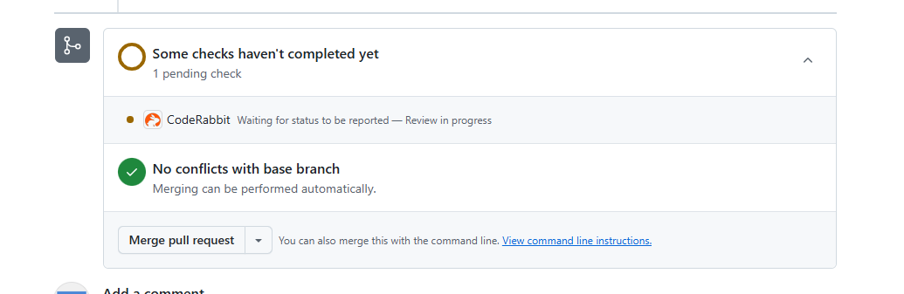

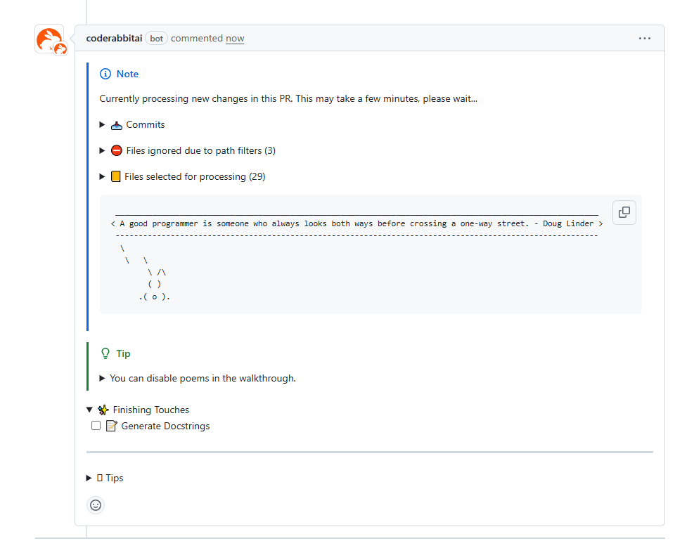

The review can take a few minutes, though the results are very impressive; with a summary and walkthrough added. For
[the first PR I created][github-kedro-pr], there was also a sequence diagram generated. Please note: all repositories
tested are private, so these links will require permissions being shared. Please reach out to Joseph McLeish if you wish
to access any of the PR links in this document and haven't yet been provided with sufficient permissions.

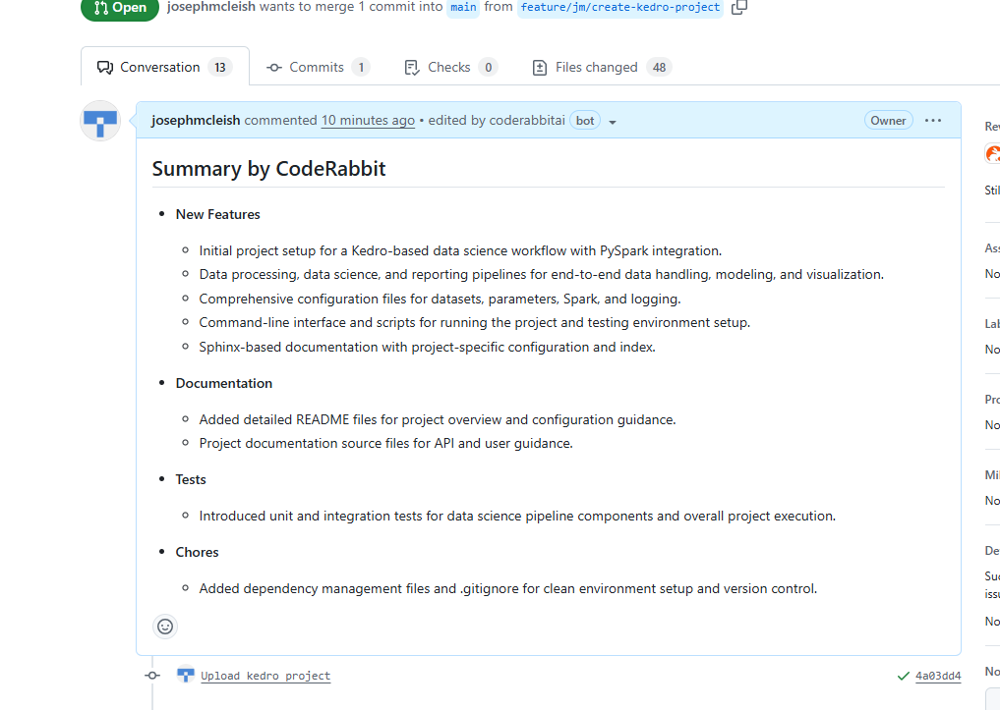

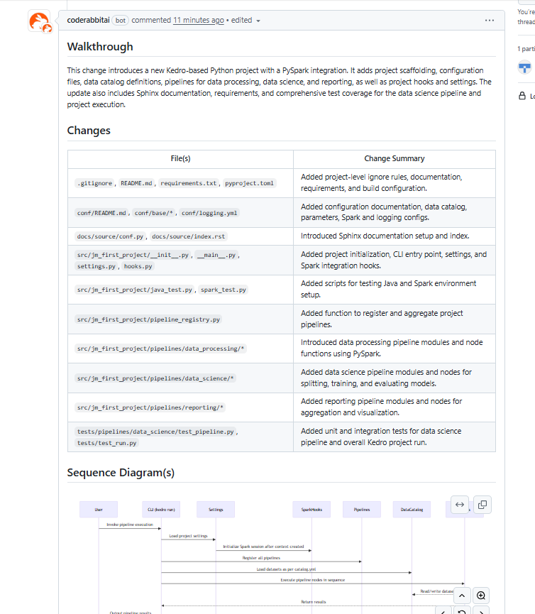

The review comments were largely excellent, though it doesn't always catch everything (like human reviewers). For the
image below, the code has a fatal issue where the end brackets have been removed, but the comment instead picks up on
the whitespace (sidenote: the phrasing is odd because I'd altered the `.coderabbit.yaml` file to request the bot speak
like Yoda from Star Wars to test whether changes to the config changed instantly in the PR where the `.coderabbit.yaml`
file is changed. This is because it's an easy-to-spot change, so I'd instantly know whether the change had been applied,
which it did).

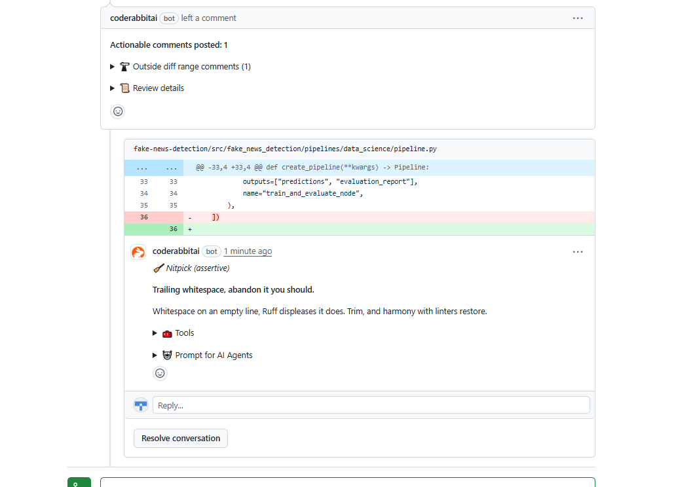

It's worth noting that for the above issue, the bot strangely noticed the issue and updated the Walkthrough and Changes
to reflect this, but this isn't where it should be pointing this out:

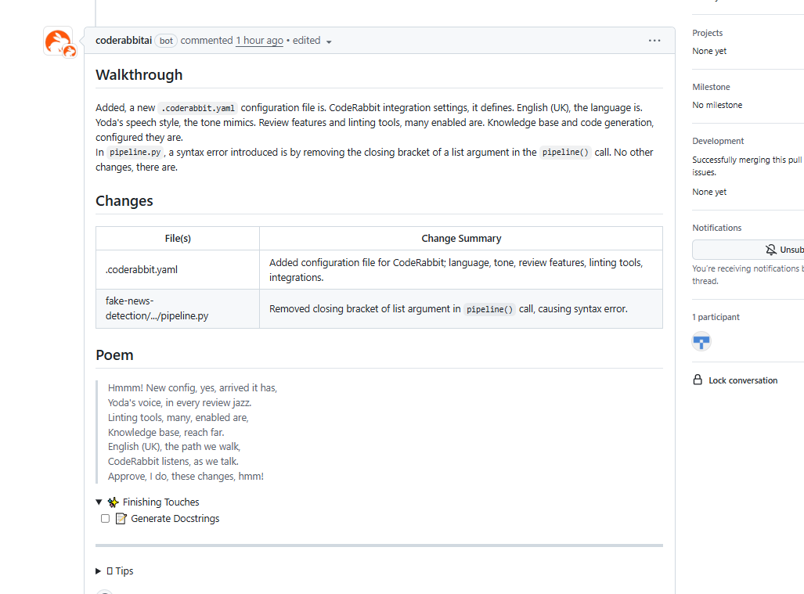

### Configure CodeRabbit

There are a couple of different ways to [customise the CodeRabbit reviewer][configure-coderabbit]: by the UI in the
CodeRabbit portal (this can be organisation-wide or project-wide) or through a `.coderabbit.yaml` file in the root
folder of the repo. You can customise how it sounds, from being more detailed (i.e. the profile being "assertive" rather
than "chill") to having a custom profile (e.g. speaking like Mr T). You can also disable/enable web search, knowledge
retention and many other features. The current config can be obtained at any time in a PR by commenting the command
`@coderabbitai configuration`:

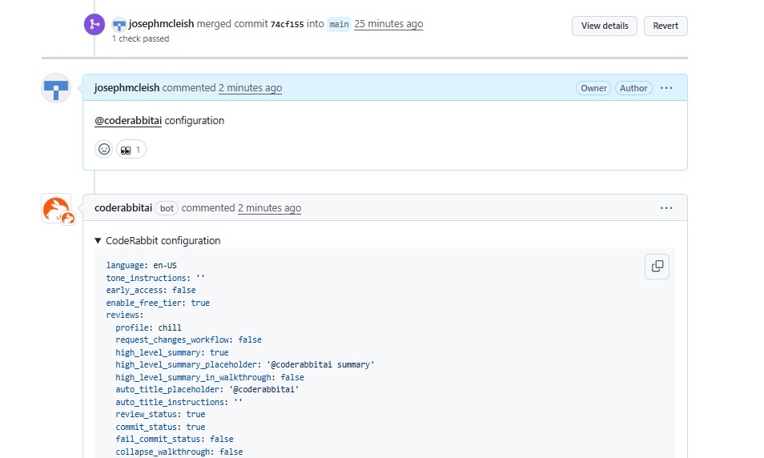

One potential flaw here is that any `.coderabbit.yaml` changes take effect from the existing PR, so changes could
feasibly be forced through by changing the settings. However, CodeRabbit isn't really an approval gatekeeper which needs
effort to get past - comments can be resolved/replied to and when you tag `@coderabbitai`, you can get
back-and-forth discussions and add learnings that persist in future reviews. This way, the reviews should become more
useful the more PRs that the bot is used for. There are many additional commands that can be used, such as [generating
docstrings][generate-docstrings] in the code automatically with `@coderabbitai generate docstrings` and the AI-generated
walkthrough always includes a collapsible menu detailing some of these commands. I was not able to test all of the
config and commands, though it would be interesting on a project to see how useful the `suggested_reviewers` setting is,
which claims to _"Suggest reviewers based on the changes in the pull request in the walkthrough"_.

Towards the end of my testing, [functionality for role-based access control was released by
CodeRabbit][role-based-access-control] which means settings such as CodeRabbit configuration can be limited to specific
individuals. I tested this with Richard Thio to see if the `.coderabbit.yaml` file could be used as a back door for
changing the config, which it is. In the portal for CodeRabbit, I verified that Richard was set the role of Member:

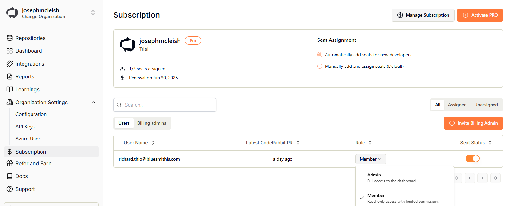

Then, we verified that Richard could not update the config from inside the portal. Note that the button in the top right
is not visible for Richard in the first image below compared with my view in the second image below:

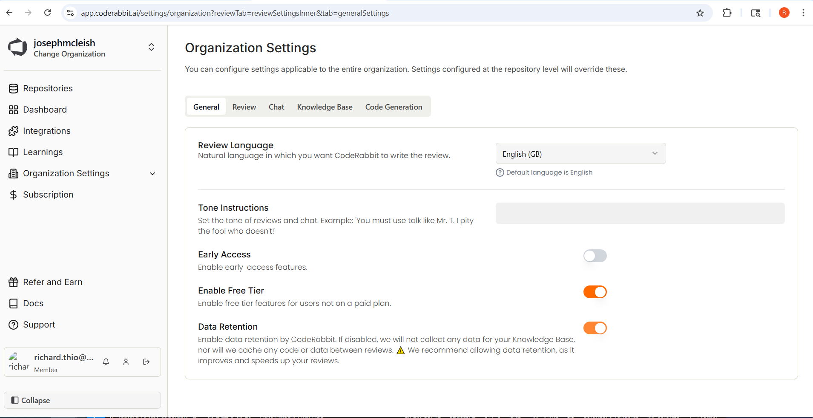

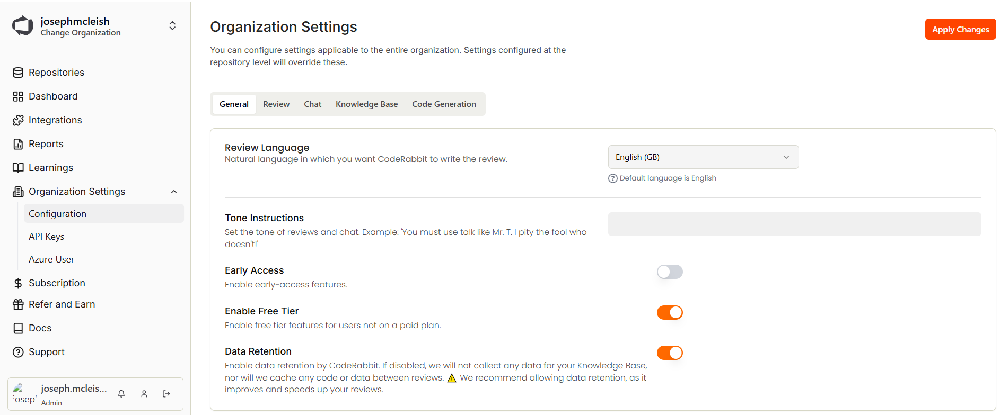

Then, we checked to see if Richard could alter these same settings by pushing a `.coderabbit.yaml` file to a PR. For the
purposes of making the change easy to notice, the change that was chosen was adding `tone_instructions` to _"Speak like
Darth Vader"_:

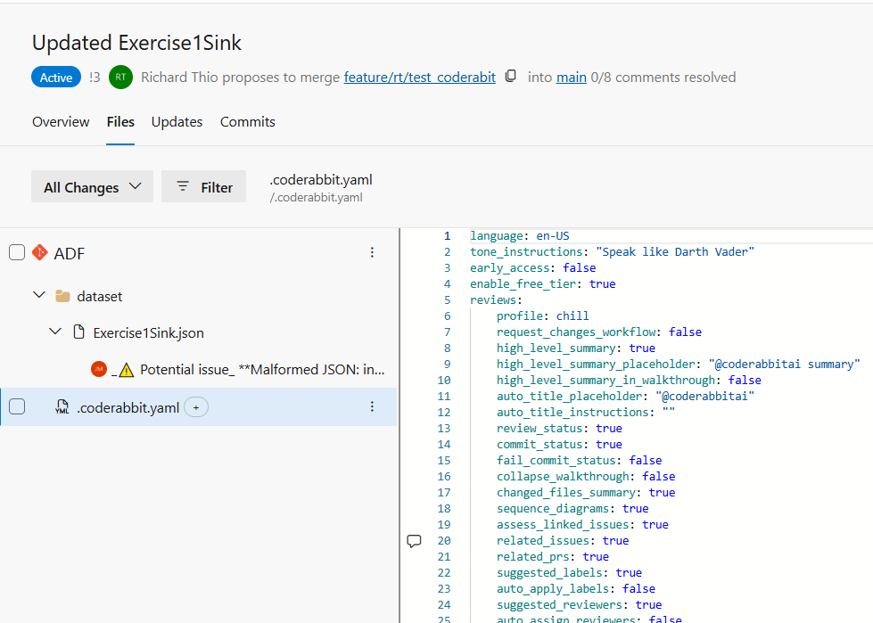

Curiously, although the new config appeared to become effective immediately, the actual review never happened:

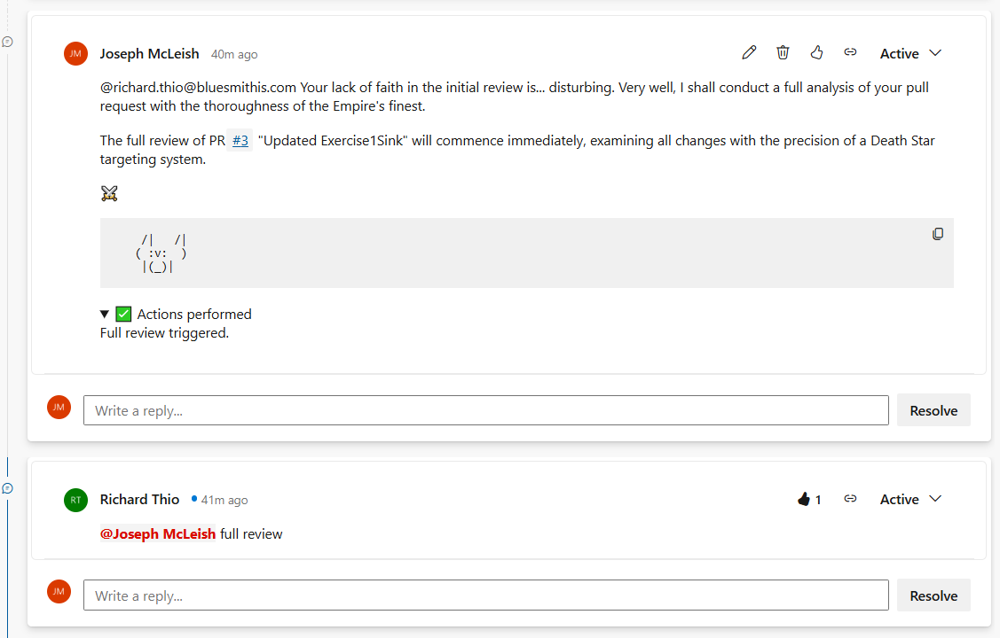

Therefore, it's difficult to establish whether this is a back door or not.

### Using CodeRabbit in Azure DevOps

In Azure DevOps CodeRabbit needs a DevOps account to use, which costs more money. For the purposes of testing, I used my
own account, which causes an interesting message when the agent sees the code as being written by itself:

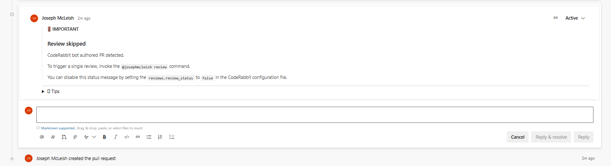

The commands also refused to work for myself:

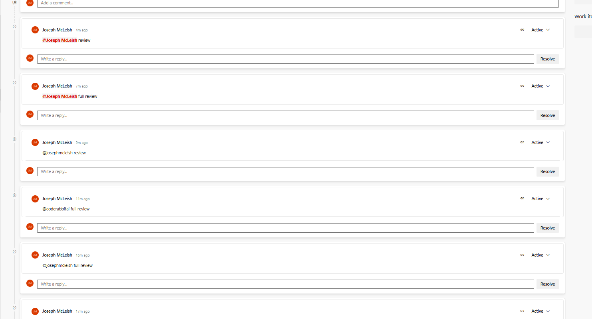

In [the same PR][devops-review], Richard Thio then tested the commands, which worked as-expected:

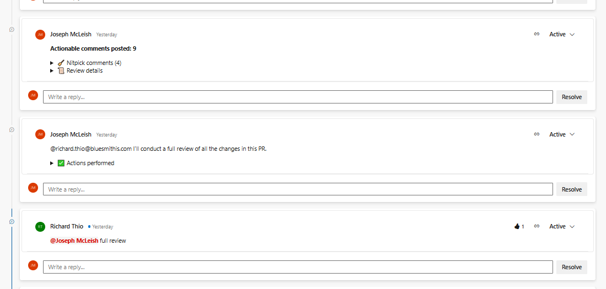

This included adding learnings:

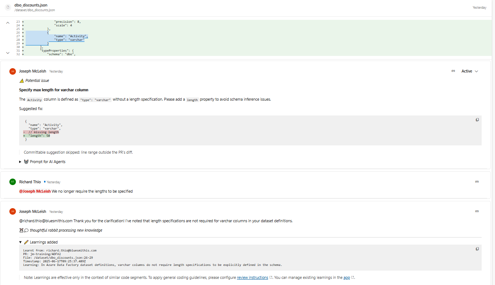

Which are then viewable in the CodeRabbit portal:

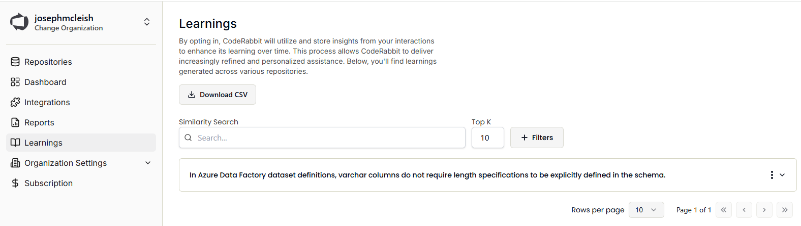

The comments also don't need to explicitly tag the CodeRabbit user (i.e. the `@` syntax still works):

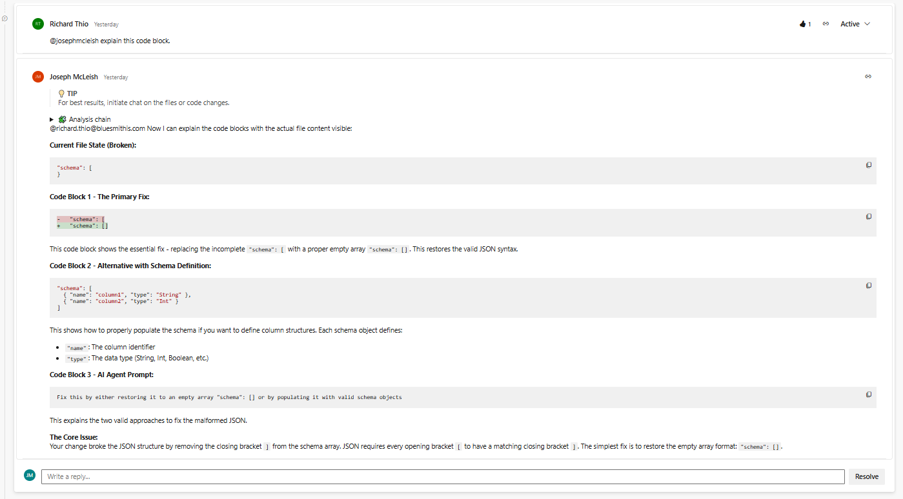

Though it's worth noting that it's designed not to reply to comments unless it's tagged in some form. For example, [when
Richard replied with the required command][devops-review-2] but didn't use the `@` syntax or tag the bot, it replied
with the following:

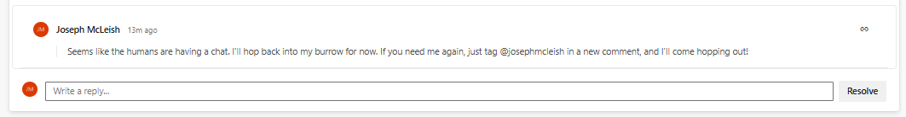

### Using CodeRabbit in VS Code

When using CodeRabbit locally in VS Code, the extension works fairly seamlessly to identify changes in the current
branch. You can choose to review committed changes, uncommitted changes or all changes:

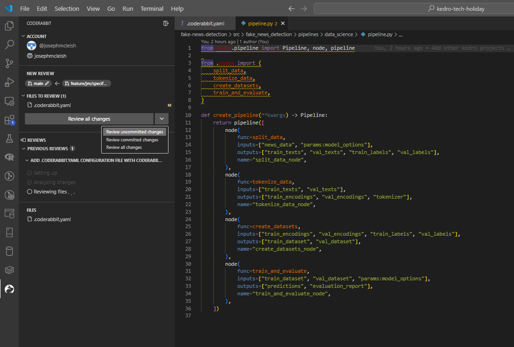

CodeRabbit shows the history of previous reviews, though isn't perfect and can miss some obvious issues, particularly in
VS Code where the detail of the review is lower (e.g. there are missing brackets below, but CodeRabbit responds with
_"No issues detected in this review. You're good to go!"_):

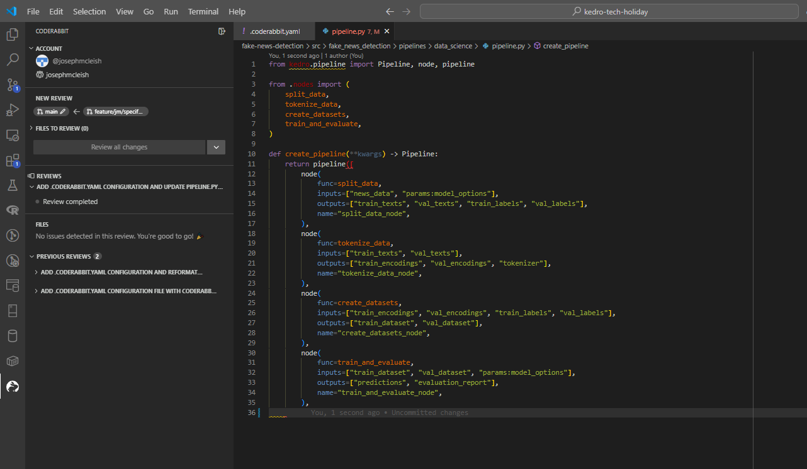

The extension doesn't need to be using code that the account is linked to. It intelligently finds out the branch and
diff from main and then reviews the changed files. These review comments aren't always about syntax/code either:

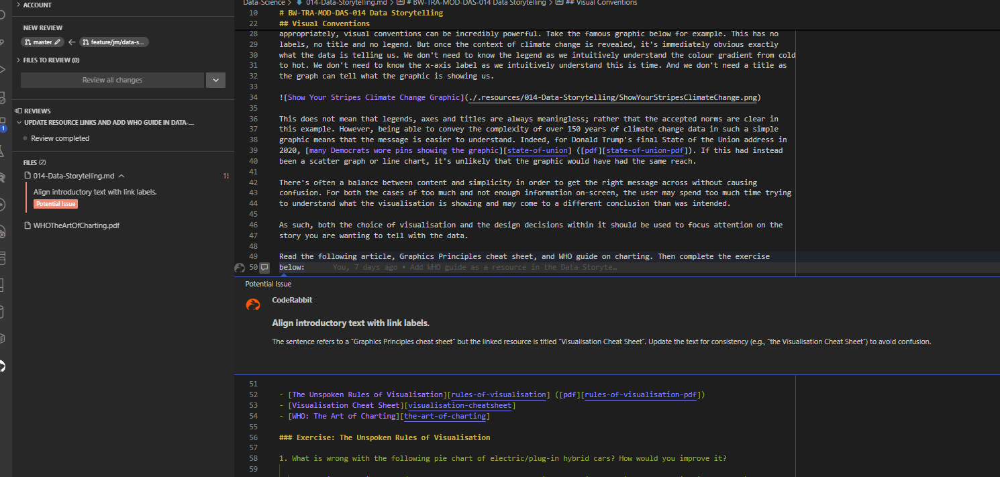

<!-- Reference Links -->

[data-privacy-and-security]: https://docs.coderabbit.ai/?#data-privacy-and-security
[data-security]: https://docs.coderabbit.ai/faq/?#data-security
[trust-coderabbit-ai]: https://trust.coderabbit.ai/
[pricing]: https://www.coderabbit.ai/pricing
[github-setup]: https://docs.coderabbit.ai/platforms/github-com
[azure-devops-setup]: https://docs.coderabbit.ai/platforms/azure-devops
[vs-code-extension]: https://marketplace.visualstudio.com/items?itemName=CodeRabbit.coderabbit-vscode&dub_id=608rPRN4zoLmFRVq
[github-kedro-pr]: https://github.com/josephmcleish/kedro-tech-holiday/pull/1
[configure-coderabbit]: https://docs.coderabbit.ai/getting-started/configure-coderabbit/
[role-based-access-control]: https://www.coderabbit.ai/blog/role-based-access-control-rbac-for-granular-permission-sets
[generate-docstrings]: https://docs.coderabbit.ai/finishing-touches/docstrings/
[devops-review]: https://dev.azure.com/josephmcleish/jm-training/_git/ADF/pullrequest/2
[devops-review-2]: https://dev.azure.com/josephmcleish/jm-training/_git/ADF/pullrequest/3
